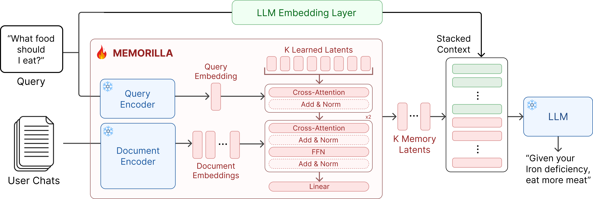

<h1 align="center">
  
  &nbsp;Memorilla: Latent Semantic Memory for LLMs
</h1>

<p align="center">
  <a href="https://openreview.net/forum?id=VV0vvzL783"></a>
  <a href="https://memory.stanford.edu/"></a>
  <a href="https://huggingface.co/memorilla"></a>
  <a href="LICENSE"></a>
</p>

This repository provides code for training and evaluating Memorilla, a memory system that gathers information from an
entire document collection into a fixed number of query-dependent memory tokens for a frozen LLM. The code is based on
our paper *[Memorilla: Latent Semantic Memory for LLMs](https://openreview.net/forum?id=VV0vvzL783)*.

A frozen LLM can only use what fits in its context window, so Memorilla reads an entire document collection, such as a
user's past chats or a long book, and hands the LLM just 16 memory tokens that carry what each question needs. With this
small budget, it achieves the best average performance against methods such as Mem0 and MemoRAG, and on FactKG it is
even more accurate than giving the LLM every document (84.33% vs. 80.43%) while using 108× fewer tokens. Furthermore, Memorilla can also help an agent keep learning from its own history, raising its average
success rate on TextWorld games from 18.6% to 24.2%.

<p align="center">
  
</p>

## Contents

- [Installation](#installation)
- [Quickstart](#quickstart)
- [Using your own data](#using-your-own-data)
- [Using the memory module in Python](#using-the-memory-module-in-python)
- [PersonalizationV4](#personalizationv4)
- [Reinforcement learning on TextWorld](#reinforcement-learning-on-textworld)
- [Documentation](#documentation)
- [Development](#development)
- [Citation](#citation)
- [License](#license)

## Installation

Memorilla needs Linux with CUDA GPUs and Python 3.11; the recipes were run on NVIDIA H100 80GB GPUs. Install it with
[uv](https://docs.astral.sh/uv/):

```bash
$ git clone https://github.com/snap-stanford/memorilla.git && cd memorilla
$ uv venv --python 3.11 && source .venv/bin/activate
$ uv pip install -e .
$ uv pip install --no-build-isolation flash-attn==2.7.4.post1
```

The last command installs FlashAttention-2, which training uses by default. Evaluation does not need it, and training
can use PyTorch's attention instead:

```bash
$ scripts/train.sh configs/stage1_enwiki.yaml --attn_implementation sdpa
```

Optional extras:

```bash
$ uv pip install -e ".[dev]"                 # tests, linters and pre-commit
$ uv pip install -e ".[wandb]"               # Weights & Biases logging
$ uv pip install -e ".[personalizationv4]"   # OpenAI client for the PersonalizationV4 pipeline
$ uv pip install -e ".[rl]"                  # TextWorld, for the RL data tools
```

## Quickstart

The recipes below train the memory module, and evaluates it on benchmarks. The data and its precomputed embeddings are downloaded from
[`memorilla/Memorilla-Data`](https://huggingface.co/datasets/memorilla/Memorilla-Data) on first use.

```bash
# Train the three stages with the Qwen3-8B decoder on 4 GPUs.
$ scripts/train.sh configs/stage1_enwiki.yaml
$ scripts/train.sh configs/stage2_mixture.yaml
$ scripts/train.sh configs/stage3_multitask.yaml

# Continue on the personalisation benchmarks.
$ scripts/train.sh configs/personalization_pv4.yaml
$ scripts/train.sh configs/personalization_pmv2.yaml

# Evaluate a checkpoint on every benchmark (or name one, e.g. factkg).
$ scripts/evaluate.sh runs/stage3/epoch-04 all
$ scripts/evaluate.sh runs/personalization_pv4/epoch-04 pv4

# Text-only baselines: closed book, RAG over the top-5 documents, full context.
$ scripts/baselines.sh closed_book all
$ scripts/baselines.sh rag all --top_k 5
$ scripts/baselines.sh full_context triviaqa
```

On 4 H100 80GB GPUs, the three stages take about 19 hours and download about 310 GiB of data and embeddings, and
evaluating a checkpoint on all eight benchmarks takes about 15 minutes on one GPU. The [training](docs/training.md) and
[evaluation](docs/evaluation.md) guides describe the main options, and each script's `--help` lists all of them.

## Using your own data

Any collection of documents with questions and answers can be trained and evaluated without code changes. Write one
parquet file per split, named like `train-00000-of-00001.parquet`, under `my_data/data/my_task/`, with one row per
question and the columns `collection_id`, `question`, `answer` and `documents`, then pass the directory as the data
repository. The embeddings are computed on first use.

```bash
$ python train.py --config configs/single_task.yaml --data_repo my_data --datasets my_task --output_dir runs/my_task
$ python evaluate.py --data_repo my_data --config my_task --split test --scoring generation --checkpoint runs/my_task/epoch-04
```

The `single_task` recipe warm-starts from the Stage 2 checkpoint; pass `--init_memory ""` to train from scratch. The
[data guide](docs/data.md#using-your-own-data) covers the file layout, document chunking and scoring options.

## Using the memory module in Python

`MemoryModule` is a plain `nn.Module`:

```python
import torch

from memorilla import MemoryModule

memory = MemoryModule(embedding_dim=2560, output_dim=4096)  # Qwen3-Embedding-4B -> Qwen3-8B, K = 16

doc_embeds = torch.randn(2, 200, 2560)  # [batch, num_docs, embedding_dim]
doc_padding_mask = torch.zeros(2, 200, dtype=torch.bool)  # True marks padded documents
question_embeds = torch.randn(2, 2560)  # [batch, embedding_dim]
memory_tokens = memory(doc_embeds, doc_padding_mask, question_embeds)  # [2, 16, 4096]

memory.save("my_memory")  # memory.pt + config.json
memory = MemoryModule.from_pretrained("runs/stage3/epoch-04")
```

Options: `num_memories`, `num_heads`, `num_self_attn_layers`, `num_cross_attn_layers`, `dropout` and
`retrieval_init`. `from_pretrained` reads `config.json` when present and otherwise infers the architecture from the
weights. The other building blocks:

- `memorilla.llm.MemoryLLM`: Hugging Face decoder with memory injection, used for training.
- `memorilla.vllm.MemoryVLLM`: vLLM decoder fed prompt embeddings, used for evaluation.
- `memorilla.embeddings.EmbeddingStore`: stored document and question embeddings of one config and split.
- `memorilla.data.MemoryCollator`: turns rows into decoder inputs with memory placeholders and padded embeddings.

`train.py` and `evaluate.py` show them working together.

## PersonalizationV4

PersonalizationV4 (PV4) is a synthetic personalisation benchmark released with Memorilla. Each of its 149 fictional
users has had 200 short conversations with an AI assistant, and each question places the user in a new scenario and
asks what they would most likely do or prefer. The questions are written to require combining at least two facts about
the user, which the conversations show but never state. The data is on
[Hugging Face](https://huggingface.co/datasets/memorilla/PersonalizationV4), and
[`personalizationv4/`](personalizationv4/README.md) documents the task, the data format and the generation pipeline.

## Reinforcement learning on TextWorld

Memorilla can also serve as the memory of an agent and learn from reward alone. [`rl/`](rl/README.md) trains the
memory module with GRPO on [TextWorld](https://github.com/microsoft/TextWorld) text adventures, using
[SkyRL-Memorilla](https://github.com/Adibvafa/SkyRL-Memorilla), a fork of [SkyRL](https://github.com/NovaSky-AI/SkyRL),
and documents its installation, data, training and evaluation.

## Documentation

| Guide | Contents |
| --- | --- |
| [Data](docs/data.md) | Released configs, row format, embedding layout, storage locations, using your own data |
| [Training](docs/training.md) | Options, recipes and stages, outputs and resuming, multiple GPUs and SLURM, single-task training |
| [Evaluation](docs/evaluation.md) | Benchmarks, metrics, outputs, and the closed-book, RAG and full-context baselines |
| [PersonalizationV4](personalizationv4/README.md) | Task and scoring, data format, generation pipeline, regeneration, license |
| [Reinforcement learning](rl/README.md) | TextWorld setup, installation, data, training and evaluation |
| [Troubleshooting](docs/troubleshooting.md) | Multi-GPU stalls, slow evaluation, offline machines |

## Development

```bash
$ uv pip install -e ".[dev]"
$ pytest                             # unit tests (CPU only, no network)
$ ruff check . && black --check .    # lint
$ pre-commit install                 # run the same checks on every commit
```

Set `MEMORILLA_TEST_CHECKPOINTS` to a directory of checkpoints to also check that each one loads strictly and runs.

## Citation

```bibtex
@inproceedings{fallahpour2026memorilla,
  title     = {Memorilla: Latent Semantic Memory for {LLM}s},
  author    = {Adibvafa Fallahpour and Parsa Idehpour and Vignesh Kothapalli and Nikita Mounier and Shirley Wu and Shayan Pardis and Jure Leskovec},
  booktitle = {COLM Workshop on Context Beyond the Window: Persistent Knowledge in Language Models},
  year      = {2026},
  url       = {https://openreview.net/forum?id=VV0vvzL783}
}
```

## License

The code is released under the [Apache 2.0 license](LICENSE). Each config of Memorilla-Data keeps the license of its
source dataset, and PersonalizationV4 is released under CC BY 4.0.
