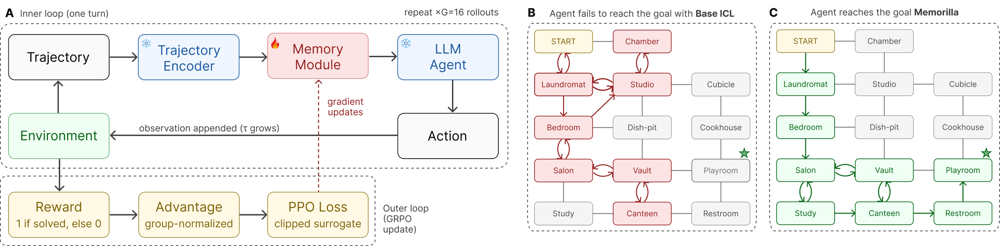
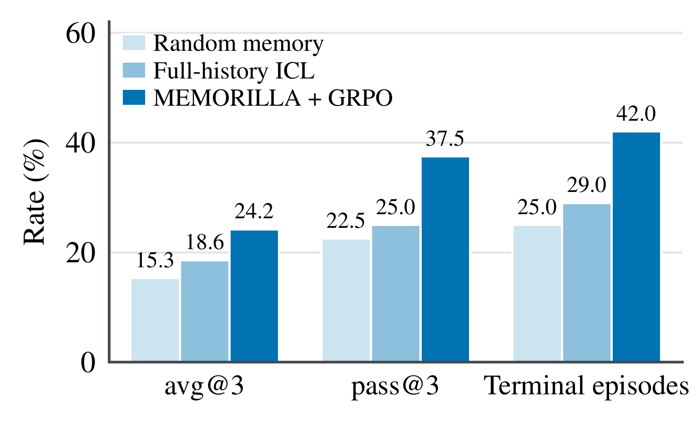

# Reinforcement learning on TextWorld

Memorilla can serve as the memory of an agent and learn from reward alone. `rl/` trains the memory module with GRPO on
[TextWorld](https://github.com/microsoft/TextWorld) text adventures, where an agent explores rooms, finds and uses
objects and completes a multi-step quest within 50 turns. Training runs on
[SkyRL-Memorilla](https://github.com/Adibvafa/SkyRL-Memorilla), a fork of [SkyRL](https://github.com/NovaSky-AI/SkyRL)
that lets a trainable encoder place vectors at reserved prompt positions, keeping the training policy and the vLLM
rollout engines in sync.

<p align="center">
  
</p>

(a) At each turn the frozen encoder embeds the trajectory, the memory module compresses it into memory vectors and the
frozen agent acts; GRPO updates only the memory module. (b, c) On a held-out game, the agent without memory loops
between explored rooms, while the agent with trained memory reaches the goal.

On the 40 held-out test prompts, training the memory module with GRPO raises the solve rate of the frozen agent over
the same agent with its full history in context (full-history ICL) and over an untrained memory module that adds the
same number of memory vectors. More of its episodes also reach an end, through the game or the 50-turn limit,
before the conversation outgrows the 4,096-token evaluation budget (terminal episodes).

<p align="center">
  
</p>

## Setup

- **Agent.** A frozen `Qwen/Qwen3-4B-Instruct-2507` reads the game and ends every turn with `[ACTION: <command>]`. The
  prompt keeps the full interaction history: the system prompt, the opening observation and every later action and
  observation.
- **Memory.** After each completed turn the environment adds the turn to a document store. The frozen
  `Qwen/Qwen3-Embedding-4B` embeds the documents, and a `memorilla.MemoryModule` compresses them into K = 8 memory
  vectors, conditioned on the mean document embedding. The vectors sit before the prompt and are recomputed at every
  turn once the first document exists.
- **Training.** Only the memory module is trained, from random initialisation, with GRPO on the game score. The
  decoder and the embedding model stay frozen.

Each document records its turns, the reward they earned and the change in game score:

```
Turns 6-6 | Reward: 0.0 | Score Change: 0

Turn 6:
Obs: -= Canteen =- You arrive in a canteen. A typical one. ...
Act: go east
```

| Tiers | Games | Environment | Turns per document | Documents kept | Observation in a document |
| --- | --- | --- | --- | --- | --- |
| medium, hard | compiled `.z8` | `textworld` (Inform7) | 1 | all (up to 60) | first 200 characters |
| long, mega, huge, extreme | `.json` spec | `fast_textworld` (in-process simulator) | 5 | 4 most recent | full |

For simulator games the system prompt also lists the command forms the game parser accepts.

| Component | Setting |
| --- | --- |
| Decoder | `Qwen/Qwen3-4B-Instruct-2507`, frozen, bf16 |
| Encoder | `Qwen/Qwen3-Embedding-4B`, frozen |
| Memory module | K = 8 slots, 8 heads, 1 document self-attention layer, 2 cross-attention layers, dropout 0.1 |
| Initialisation | Xavier-uniform slots and output projection (the `MemoryModule` defaults); without `checkpoint_path` the SkyRL-Memorilla handler then redraws the output projection from N(0, 0.01) with zero bias, so the first memory vectors are small |
| Slots | `memory.num_memories` sets K and the number of reserved placeholder tokens in the modality and both environments |
| Widths | `embedding_dim` and `output_dim` (2560) must equal the hidden sizes of the encoder and the decoder; change them together with the embedding model or `trainer.policy.model.path` |
| Algorithm | GRPO with 16 rollouts per prompt and group-normalised advantages; PPO clip 0.2, token-mean loss, no KL or entropy term |
| Optimiser | AdamW, constant learning rate 5e-4 without warmup, weight decay 0.01, gradient-norm clip 1.0 |
| Batch | 4 prompts per step (64 rollouts), one update per batch |
| Rollouts | temperature 1.0, up to 128 new tokens per turn and 50 turns, prompt up to 16,000 tokens, engine context 16,384 |
| Reward | the game score after each turn, as TextWorld reports it, with no shaping; a rollout's return is the sum over its turns, so a game with a single one-point quest returns 1 if solved and 0 otherwise |
| Schedule | 10 epochs; checkpoint and greedy validation every 3 steps |
| Hardware | one GPU, with the policy and the vLLM engine colocated |
| Evaluation | 3 rollouts per prompt at temperature 0.6, prompt up to 4,096 tokens; avg@3 and pass@3 |

The full configuration is `rl/configs/textworld_grpo.yaml` (training) and `rl/configs/textworld_eval.yaml`
(evaluation), both composed on top of SkyRL's `ppo_base_config`. Any value can be overridden on the command line in
Hydra syntax.

## Installation

The RL stack uses the fork's own pinned environment (Python 3.12, vLLM 0.11). Install Memorilla into it without
dependencies; the RL code only needs `memorilla.memory`.

```bash
git clone https://github.com/snap-stanford/memorilla.git
git clone https://github.com/Adibvafa/SkyRL-Memorilla.git skyrl-memorilla
git -C skyrl-memorilla checkout 0ce9767c76efd9ac3907065bbbd674411311a666

cd skyrl-memorilla/skyrl-train
uv sync --extra vllm
source .venv/bin/activate
uv pip install --no-deps -e ../../memorilla
cd ../../memorilla
```

All RL commands below run from the root of this repository inside that environment. The data, scoring and export
scripts (`rl/generate_games.py`, `rl/build_dataset.py`, `rl/aggregate.py`, `rl/export_memory.py`) also run in the main
Memorilla environment once the `rl` extra (TextWorld) is installed with `uv pip install -e ".[rl]"`.

## Data

Generate the games, then build the dataset. Medium and hard games are compiled with `tw-make`; the long tiers are
written as game specs for the simulator. Long-tier generation is slow (minutes per game for the largest quests), and
parameter draws the quest planner cannot satisfy are skipped; by default the script tries up to four draws per requested
game (`--max_attempts`) and reports how many games it built.

```bash
python rl/generate_games.py --output_dir games/medium_hard --tiers medium:0.3,hard:0.7 --num_games 400 --workers 16
for tier in long mega huge extreme; do
  python rl/generate_games.py --output_dir games/$tier --tiers $tier:1 --num_games 20 --workers 16
done
python rl/build_dataset.py --games_dirs games/* --output_dir data/textworld
```

Each tier is split by game: 5 games (`--held_out`) go to test, 5 to validation and the rest to training. A compiled
game becomes two episodes, each with a prompt (system and user message) drawn from four variants by the game seed (the
two draws can coincide), and a game spec one episode with the default prompt, which gives 800 training, 40 validation
and 40 test prompts. Every row holds the chat prompt, the environment (`textworld` or `fast_textworld`), the game file
and the tier (`data_source`), so SkyRL reports metrics per tier.

## Training

```bash
bash rl/train.sh data/textworld runs/textworld
```

Checkpoints go to `runs/textworld/checkpoints/global_step_<N>`, and rerunning the command resumes from the latest one. A
checkpoint is written every 3 steps and each one holds the full policy state, including the frozen decoder, so cap disk
use with `trainer.max_ckpts_to_keep=<n>`. Validation rollouts are dumped to `runs/textworld/exports/dumped_evals/` and
the configuration and log of every launch to a timestamped directory under `runs/textworld/exports/hydra/`. Log to
Weights & Biases with `trainer.logger=wandb` (and `WANDB_API_KEY` set).

To keep only the memory module of a checkpoint as a Memorilla checkpoint (`memory.pt` and `config.json`), run the
command below. It reads checkpoints of single-GPU runs, and `--num_heads` must match the memory module's heads (8 by
default):

```bash
python rl/export_memory.py runs/textworld/checkpoints/global_step_<N> runs/textworld/memory
```

## Evaluation

`rl/evaluate.sh <data_dir> <split> <output_dir> <model>` plays every prompt of a split three times at temperature 0.6
and writes `metrics.json` to the output directory. The model is a training checkpoint, an exported memory checkpoint,
`untrained` (a randomly initialised memory module) or `no-memory` (the decoder with its full history only).

```bash
bash rl/evaluate.sh data/textworld test evals/memorilla runs/textworld/checkpoints/global_step_<N>
for seed in 0 1 2; do
  bash rl/evaluate.sh data/textworld test evals/untrained/seed$seed untrained trainer.seed=$seed
  bash rl/evaluate.sh data/textworld test evals/no_memory/seed$seed no-memory trainer.seed=$seed
done
python rl/aggregate.py evals/untrained/seed* --output evals/untrained/metrics.json
python rl/aggregate.py evals/no_memory/seed* --output evals/no_memory/metrics.json
```

`rl/aggregate.py` reads the rollouts SkyRL dumps per tier and prints a table; `metrics.json` holds the same values
under `metrics`, keyed by tier plus `all` for every tier together. Each entry has the number of `episodes` and
`rollouts` and the metrics below; with three rollouts per prompt, `avg@k` and `pass@k` are avg@3 and pass@3. Given
several output directories (for example one per seed), it averages each metric over them, and a single
`dumped_evals/global_step_<N>_evals` directory also works, for example to score one validation round of training.

| Key | Definition |
| --- | --- |
| `avg@k` | fraction of rollouts solved, where a rollout is solved when its final turn earns a positive reward |
| `pass@k` | fraction of prompts solved by at least one of their rollouts |
| `mean_reward` | mean total reward per rollout, the sum of its turn rewards |
| `terminal` | fraction of rollouts that end through the game (a win or a loss) or the turn limit |
| `truncated` | fraction of rollouts stopped because the conversation outgrew the input budget or the last response hit the generation limit |

## Files

| File | Purpose |
| --- | --- |
| `rl/configs/textworld_grpo.yaml` | training configuration |
| `rl/configs/textworld_eval.yaml` | evaluation configuration |
| `rl/train.sh` | launch GRPO training |
| `rl/evaluate.sh` | evaluate a checkpoint, an untrained memory module or the decoder without memory |
| `rl/generate_games.py` | generate TextWorld games per difficulty tier |
| `rl/build_dataset.py` | split games and write the train, validation and test parquet files |
| `rl/aggregate.py` | compute avg@k, pass@k, mean reward, terminal and truncated rollouts per tier |
| `rl/export_memory.py` | export the memory module of a training checkpoint |

The environments live in [SkyRL-Memorilla](https://github.com/Adibvafa/SkyRL-Memorilla) under
`skyrl-gym/skyrl_gym/envs/textworld/` and the memory encoder in
`skyrl-train/skyrl_train/examples/modalities/memorilla_handlers.py`.
